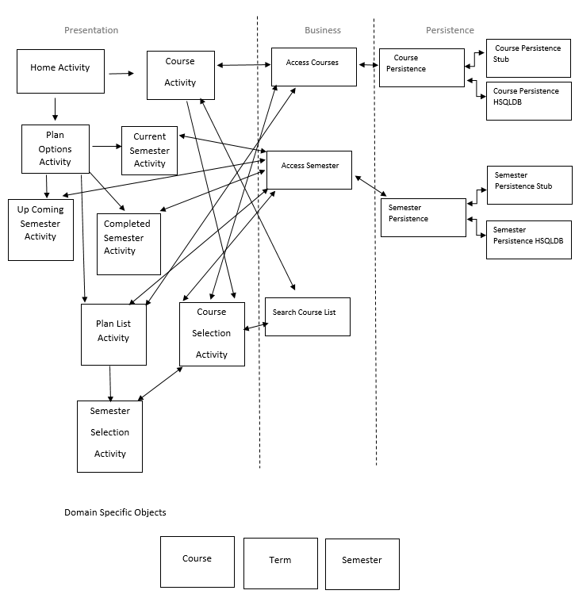
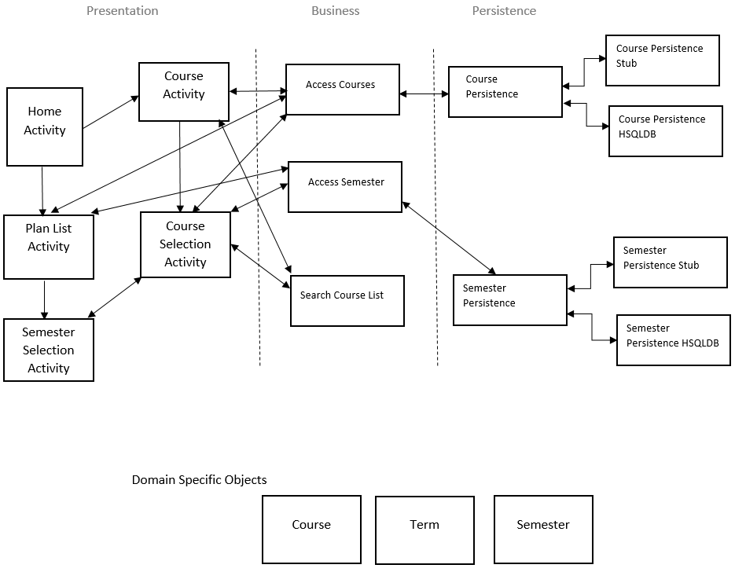
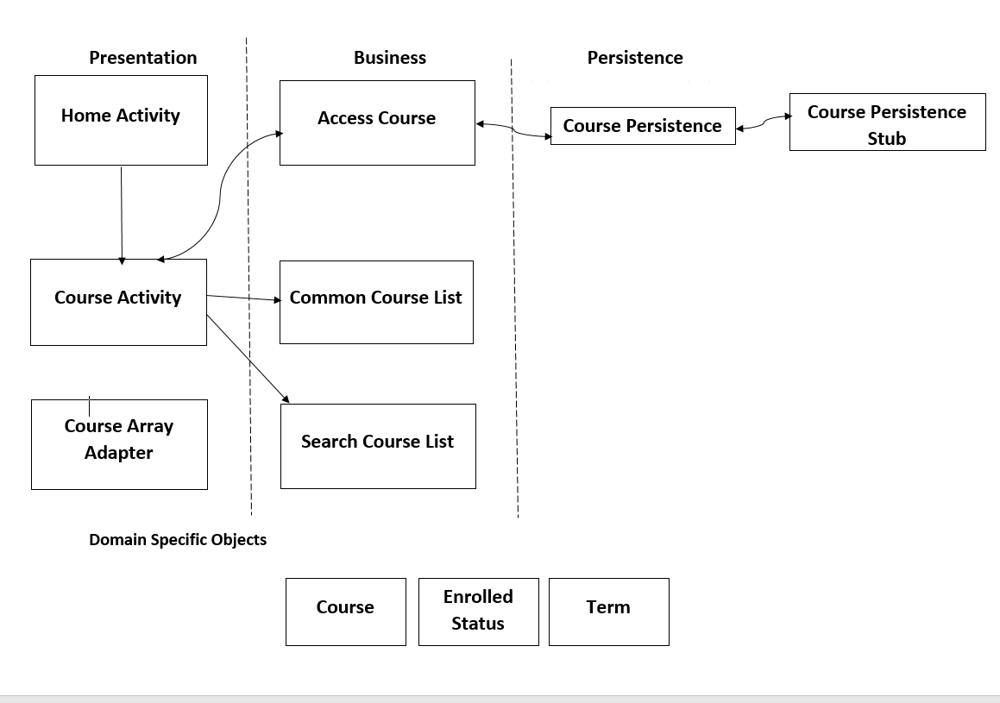

##  Architecture 

## Iteration 3 Diagram

## Iteration 2 Diagram
 

## Iteration 1 Diagram
 

## Architecture

* Our UmPlanner app is based on the 3 tier architecture. It consist of Presentation, Business and the Persistence Layer.

## Presentation Layer
[HomeActivity](https://code.cs.umanitoba.ca/3350-winter-2021-a02/group-10/umplanner-comp3350-a02-group10/-/tree/master/app/src/main/java/com/cth/myapplication/presentation/HomeActivity.java)

* It is the Home page UI of the application.

[CourseActivity](https://code.cs.umanitoba.ca/3350-winter-2021-a02/group-10/umplanner-comp3350-a02-group10/-/tree/master/app/src/main/java/com/cth/myapplication/presentation/CourseActivity.java)

* It is the list of all Courses.

[CourseSelectionActivity](https://code.cs.umanitoba.ca/3350-winter-2021-a02/group-10/umplanner-comp3350-a02-group10/-/tree/master/app/src/main/java/com/cth/myapplication/presentation/CourseSelectionActivity.java)

* It is the list of Selecting a Course.

[PlanListActivity](https://code.cs.umanitoba.ca/3350-winter-2021-a02/group-10/umplanner-comp3350-a02-group10/-/tree/master/app/src/main/java/com/cth/myapplication/presentation/PlanListActivity.java)

* The class for Planning a Schedule.

[SemesterSelectionActivity](https://code.cs.umanitoba.ca/3350-winter-2021-a02/group-10/umplanner-comp3350-a02-group10/-/tree/master/app/src/main/java/com/cth/myapplication/presentation/SemesterSelectionActivity.java)

* The class for course semester.

## Business Layer
[AccessCourses](https://code.cs.umanitoba.ca/3350-winter-2021-a02/group-10/umplanner-comp3350-a02-group10/-/tree/master/app/src/main/java/com/cth/myapplication/business/AccessCourses.java)

* The main class that deals with the persistence layer to access the courses.

[SearchCourseList](https://code.cs.umanitoba.ca/3350-winter-2021-a02/group-10/umplanner-comp3350-a02-group10/-/tree/master/app/src/main/java/com/cth/myapplication/business/SearchCourseList.java)

* The main class that deals with the persistence layer with  the Search Course list

[AccessSemester](https://code.cs.umanitoba.ca/3350-winter-2021-a02/group-10/umplanner-comp3350-a02-group10/-/tree/master/app/src/main/java/com/cth/myapplication/business/AccessSemester.java)

* The main class that deals with the persistence layer to access the semester.

## Persistence Layer
[CoursePersistence](https://code.cs.umanitoba.ca/3350-winter-2021-a02/group-10/umplanner-comp3350-a02-group10/-/tree/master/app/src/main/java/com/cth/myapplication/persistence/CoursePersistence.java)

* The interface for the courses in the database.

[SemesterPersistence](https://code.cs.umanitoba.ca/3350-winter-2021-a02/group-10/umplanner-comp3350-a02-group10/-/tree/master/app/src/main/java/com/cth/myapplication/persistence/SemesterPersistence.java)

* The interface for the semester course in the database.

## Stubs
[CoursePersistenceStub](https://code.cs.umanitoba.ca/3350-winter-2021-a02/group-10/umplanner-comp3350-a02-group10/-/tree/master/app/src/main/java/com/cth/myapplication/persistence/Stub/CoursePersistenceStub.java)

* Course implementation for the fake "database" for the app.

[SemesterPersistenceStub](https://code.cs.umanitoba.ca/3350-winter-2021-a02/group-10/umplanner-comp3350-a02-group10/-/tree/master/app/src/main/java/com/cth/myapplication/persistence/Stub/SemesterPersistenceStub.java)

* Semester implementation for the fake "database" for the app.

## Hsqldb
[CoursePersistenceHSQLDB](https://code.cs.umanitoba.ca/3350-winter-2021-a02/group-10/umplanner-comp3350-a02-group10/-/tree/master/app/src/main/java/com/cth/myapplication/persistence/hsqldb/CoursePersistenceHSQLDB.java)

* It is the Course database implementation.

[SemesterPersistenceHSQLDB](https://code.cs.umanitoba.ca/3350-winter-2021-a02/group-10/umplanner-comp3350-a02-group10/-/tree/master/app/src/main/java/com/cth/myapplication/persistence/hsqldb/SemesterPersistenceHSQLDB.java)

* It is the Semester database implementation.

## Domain objects
[Course](https://code.cs.umanitoba.ca/3350-winter-2021-a02/group-10/umplanner-comp3350-a02-group10/-/tree/master/app/src/main/java/com/cth/myapplication/objects/Course.java)

* The Course Object.

[Term](https://code.cs.umanitoba.ca/3350-winter-2021-a02/group-10/umplanner-comp3350-a02-group10/-/tree/master/app/src/main/java/com/cth/myapplication/objects/Term.java)

* The Term object.

[Semester](https://code.cs.umanitoba.ca/3350-winter-2021-a02/group-10/umplanner-comp3350-a02-group10/-/tree/master/app/src/main/java/com/cth/myapplication/objects/Semester.java)

* The Semester object.
